<div align="center">

# Fighting Barren Plateaus in Volatility Forecasting for Highly Liquid Assets

## Борьба с Barren Plateau при прогнозировании волатильности высоколиквидных активов (MOEX, USD/RUB)

[](https://www.python.org/)
[](https://pennylane.ai/)
[](https://pytorch.org/)
[](https://scikit-learn.org/)
[](https://numpy.org/)
[](https://pandas.pydata.org/)

</div>

---

## О проекте

Проект — продолжение предыдущей работы по диагностике эффекта **barren plateau** («бесплодного плато») у вариационных квантовых классификаторов. Если в предыдущей статье эксперимент строился на синтетических датасетах `Circles` и `Moons`, то здесь та же диагностика переносится на задачу, приближенную к реальной практике количественного анализа российского рынка: **прогнозирование режима волатильности индекса МосБиржи (MOEX)** с использованием макроэкономических индикаторов — ключевой ставки ЦБ РФ и инфляции.

Научная новизна работы — не просто перенос старой методики на новые данные, а проверка двух содержательных гипотез:

1. **Concept Drift ускоряет наступление barren plateau.** Российский рынок регулярно проходит через резкие структурные сдвиги (циклы повышения/снижения ключевой ставки, кризисные шоки), которые формально можно диагностировать как дрейф распределения признаков. Гипотеза: обучение на участках с высоким дрейфом должно приводить к более быстрому коллапсу градиентного сигнала, чем на стабильных участках.
2. **Способ кодирования макропризнаков имеет значение.** Сравнивается классический **Angle Encoding** ключевой ставки и инфляции с **IQP Encoding** (Instantaneous Quantum Polynomial) — более выразительной, но потенциально более склонной к barren plateau схемой встраивания данных.

Дополнительно расширяется адаптивная стратегия пересборки Ansatz из предыдущей статьи: к триггерам «недостаточная выразительность» / «barren plateau» добавляется **drift-aware триггер**, принудительно сбрасывающий схему к минимальной сложности при обнаружении barren plateau на участке с высоким уровнем Concept Drift.

Число кубитов во всех экспериментах варьируется по сетке **2, 4, 6, 8, 10**.

---

## Concept Drift и Barren Plateau: постановка задачи

**Barren plateau** — эффект, при котором ландшафт функции потерь становится почти плоским, а градиенты параметров схемы стремятся к нулю:

$$
\mathbb{E}_{\theta}\left[\frac{\partial C(\theta)}{\partial \theta_i}\right] \approx 0, \qquad
\mathrm{Var}\left[\frac{\partial C(\theta)}{\partial \theta_i}\right] \to 0
$$

где $C(\theta)$ — функция стоимости, $\theta_i$ — параметр квантовой схемы. При росте числа кубитов $n$ дисперсия градиента может затухать экспоненциально:

$$
\mathrm{Var}\left[\frac{\partial C(\theta)}{\partial \theta_i}\right] \sim \mathcal{O}\left(\frac{1}{2^n}\right)
$$

**Concept Drift** — изменение совместного распределения признаков и/или связи «признаки → целевая переменная» во времени, характерное для финансовых рядов при структурных сдвигах в экономике. В работе он измеряется через **Population Stability Index (PSI)** между соседними скользящими окнами по ключевой ставке и инфляции:

$$
\mathrm{PSI} = \sum_{i} (p_i^{curr} - p_i^{prev}) \cdot \ln\left(\frac{p_i^{curr}}{p_i^{prev}}\right)
$$

где $p_i^{prev}$, $p_i^{curr}$ — доли наблюдений в $i$-м бине гистограммы признака в предыдущем и текущем окне. Гипотеза исследования: чем выше локальный PSI, тем быстрее должна затухать дисперсия градиента $\mathrm{Var}[\partial C / \partial \theta_i]$ при обучении на этом участке.

---

## Подготовка данных

**Котировки — MOEX ISS API.** Индекс МосБиржи (`IMOEX`, борд `SNDX`, рынок `index`) загружен через `apimoex.get_board_history` с 2019-01-01 по текущую дату.

**Ключевая ставка + инфляция — сайт ЦБ РФ.** Помесячные значения ключевой ставки и инфляции получены с `cbr.ru/hd_base/infl/` через `pandas.read_html` и растянуты на дневную сетку котировок методом `ffill`.

**Итоговый `data.csv`:** 1890 наблюдений после построения признаков и удаления `NaN` (2019-01 — 2026-08), классы целевой переменной сбалансированы: 945 наблюдений `y_high_vol=0` и 945 — `y_high_vol=1`.

**Целевая переменная.** Бинарный режим волатильности индекса МосБиржи:

$$y_{high_{vol}} = \mathbb{I}\bigl[\sigma_{t+1:t+5} > \mathrm{median}(\sigma_{\cdot})\bigr],$$

где $\sigma_{t+1:t+5}$ — реализованная волатильность лог-доходностей на горизонте 5 торговых дней вперёд (annualized). Порог — медиана по всей выборке; классы сбалансированы ровно 50/50.

**Признаки.** Базовые входы моделей — `key_rate` и `inflation` (стандартизованные). Дополнительно строятся `real_vol_10`, `mom_5`, `ret_lag1`, но в квантовые схемы подаются именно два макроиндикатора; при $n > 2$ они расширяются до $n$ признаков фиксированным набором нелинейных преобразований (`x²`, `x·y`, $\sin/\cos$, норма и т.д.) с последующим `MinMaxScaler` в $[-\pi,\pi]$.

**Concept Drift (PSI).** Считается по скользящим окнам длины 60 с шагом 20 отдельно по ключевой ставке и инфляции, затем суммируется. Разбиение — квантили 0.4 / 0.6:

| Режим | Наблюдений | Средний PSI |
|---|---:|---:|
| `NoDrift` (нижние 40% по PSI) | 762 | 18.35 |
| `WithDrift` (верхние 40% по PSI) | 760 | 39.84 |

Из каждого режима случайно взято по 300 наблюдений, train/test разбито 70/30 (≈210/90) со стратификацией по классу.

### Индекс МосБиржи, макроиндикаторы и динамика Concept Drift

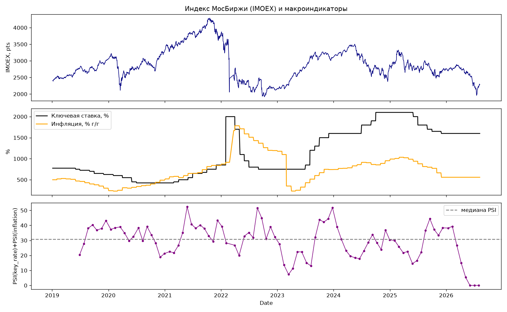

На графике хорошо видны реальные исторические события российского денежного рынка: снижение ставки в 2019–2020 гг., резкий скачок ключевой ставки в марте 2022 г., цикл повышения ставки в 2023–2024 гг. до пика и последующее смягчение в 2025–2026 гг. Пики PSI на нижней панели закономерно совпадают с границами этих циклов.

> На средней панели значения ключевой ставки и инфляции показаны с масштабирующим артефактом (умножены на 100 уже после перевода в доли), поэтому ось `%` отображает 500–2100 вместо 5–21 — сама форма динамики (циклы, пики, спады) верна и соответствует реальной истории ЦБ РФ, искажён только масштаб оси.

---

## Variational Quantum Classifiers (наивный базовый эксперимент)

Наивный базовый эксперимент подаёт на вход всего 2 признака (`key_rate`, `inflation`) независимо от числа кубитов — `AngleEmbedding` при нехватке признаков просто не поворачивает лишние кубиты.

### VQC

| Dataset | n_qubits | Loss_final | Gradient_Norm | Gradient_Variance |
|---|---:|---:|---:|---:|
| NoDrift | 2 | 0.6193 | 5.2e-06 | 1.84e-12 |
| NoDrift | 4 | 0.6455 | 5.2e-05 | 1.16e-10 |
| NoDrift | 6 | 0.6444 | 3.3e-05 | 3.02e-11 |
| NoDrift | 8 | 0.6444 | 2.2e-05 | 9.89e-12 |
| NoDrift | 10 | 0.6444 | 2.7e-05 | 1.16e-11 |
| WithDrift | 2 | 0.6229 | 2.8e-05 | 7.03e-11 |
| WithDrift | 4 | 0.6240 | 2.7e-06 | 4.41e-13 |
| WithDrift | 6 | 0.6240 | 3.1e-05 | 2.76e-11 |
| WithDrift | 8 | 0.6240 | 3.9e-05 | 3.22e-11 |
| WithDrift | 10 | 0.6240 | 2.2e-05 | 7.94e-12 |

Градиенты уже на этом наивном шаге находятся в диапазоне $10^{-11}–10^{-13}$ независимо от числа кубитов — модель фактически стартует близко к области barren plateau из-за того, что лишние кубиты (4, 6, 8, 10) не получают содержательного сигнала.

### VQC_hybrid

| Dataset | n_qubits | Loss_final | Gradient_Norm | Gradient_Variance |
|---|---:|---:|---:|---:|
| NoDrift | 2 | 0.5842 | 0.0020 | 1.97e-07 |
| NoDrift | 4 | 0.5811 | 0.0130 | 4.16e-06 |
| NoDrift | 6 | 0.5812 | 0.0226 | 8.36e-06 |
| NoDrift | 8 | 0.5824 | 0.0326 | 1.32e-05 |
| NoDrift | 10 | 0.5722 | 0.0912 | 8.29e-05 |
| WithDrift | 2 | 0.5680 | 0.0111 | 6.10e-06 |
| WithDrift | 4 | 0.5657 | 0.0313 | 2.30e-05 |
| WithDrift | 6 | 0.5689 | 0.1247 | 2.56e-04 |
| WithDrift | 8 | 0.5663 | 0.0625 | 4.89e-05 |
| WithDrift | 10 | 0.5715 | 0.0899 | 7.96e-05 |

Линейная голова после квантового слоя (`nn.Linear(n_qubits, 1)`) устойчиво поддерживает градиентный сигнал по сравнению с чистым `VQC` — значения на 3–7 порядков выше, и заметен рост нормы и дисперсии градиента вместе с ростом числа кубитов, в отличие от наивного `VQC`.

### MLP (классический бейзлайн)

| Dataset | Hidden_Layers | Loss_final |
|---|---|---:|
| NoDrift | [8, 8] | 0.6365 |
| NoDrift | [16, 16] | 0.6192 |
| NoDrift | [32, 32] | 0.6012 |
| WithDrift | [8, 8] | 0.6457 |
| WithDrift | [16, 16] | 0.6179 |
| WithDrift | [32, 32] | 0.5750 |

Классический MLP на тех же 2 признаках стабильно снижает loss с ростом ширины сети — ожидаемое поведение, не подверженное barren plateau, и удобная точка отсчёта для квантовых моделей.

---

## Baseline VQC Diagnostics

После расширения признаков через `expand_features_for_qubits` + `prepare_quantum_features` диагностика `VQC` (Angle Encoding) при пяти значениях числа кубитов:

| Dataset | n_qubits | Final_Loss | Mean_Last20_Grad_Var | F1 |
|---|---:|---:|---:|---:|
| NoDrift | 2 | 0.6166 | 2.65e-10 | 0.681 |
| NoDrift | 4 | 0.6414 | 1.82e-10 | 0.646 |
| NoDrift | 6 | 0.6430 | 2.76e-10 | 0.659 |
| NoDrift | 8 | 0.6433 | 8.50e-11 | 0.673 |
| NoDrift | 10 | 0.6345 | 3.40e-09 | 0.667 |
| WithDrift | 2 | 0.6520 | 1.61e-11 | 0.448 |
| WithDrift | 4 | 0.6001 | 1.62e-09 | 0.456 |
| WithDrift | 6 | 0.6061 | 2.61e-08 | 0.415 |
| WithDrift | 8 | 0.6251 | 1.28e-10 | 0.647 |
| WithDrift | 10 | 0.6285 | 6.74e-08 | 0.437 |

<table>
<tr><td width="50%">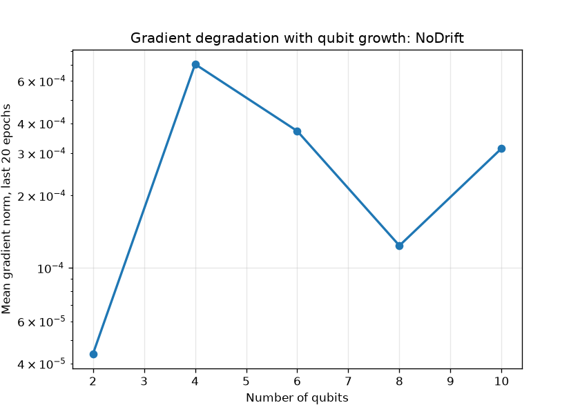</td><td width="50%">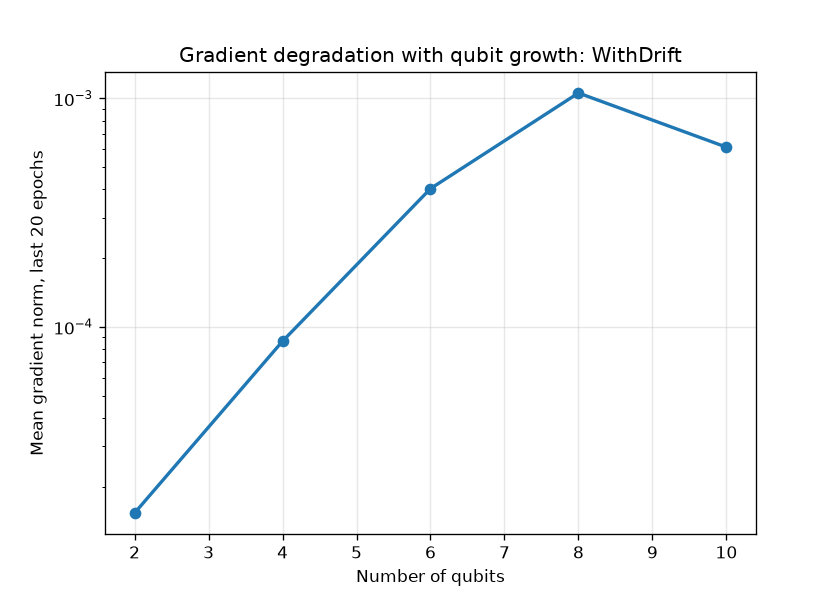</td></tr>
</table>

<table>
<tr><td width="75%">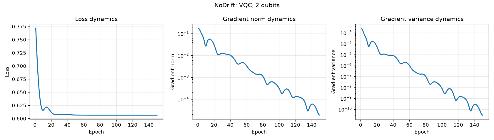</td></tr>
<tr><td width="75%">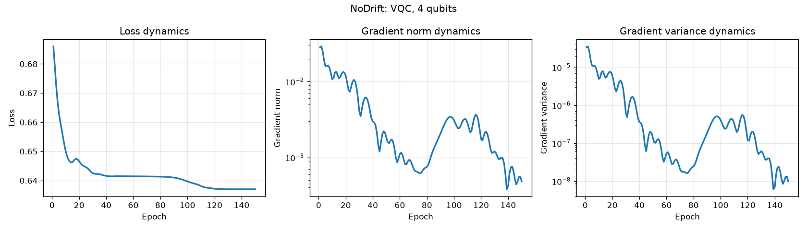</td></tr>
<tr><td width="75%">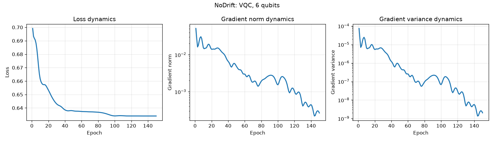</td></tr>
<tr><td width="75%">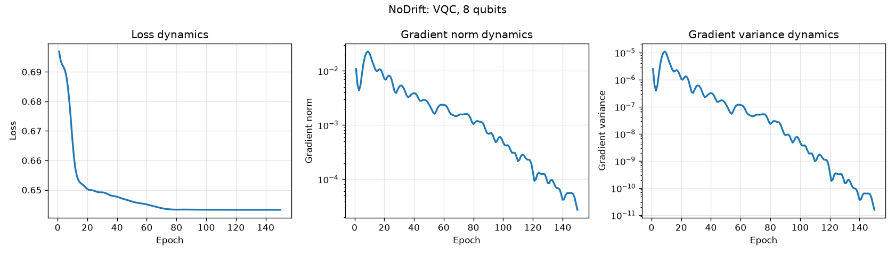</td></tr>
<tr><td width="75%">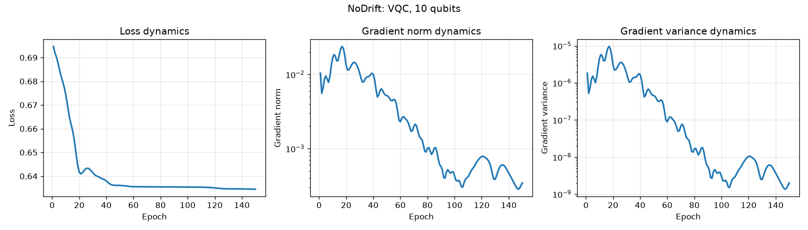</td></tr>
<tr><td width="75%">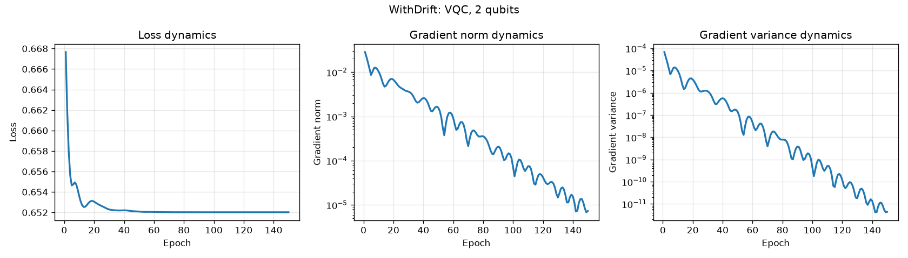</td></tr>
<tr><td width="75%">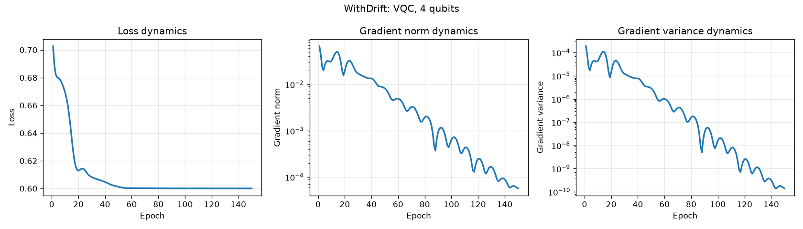</td></tr>
<tr><td width="75%">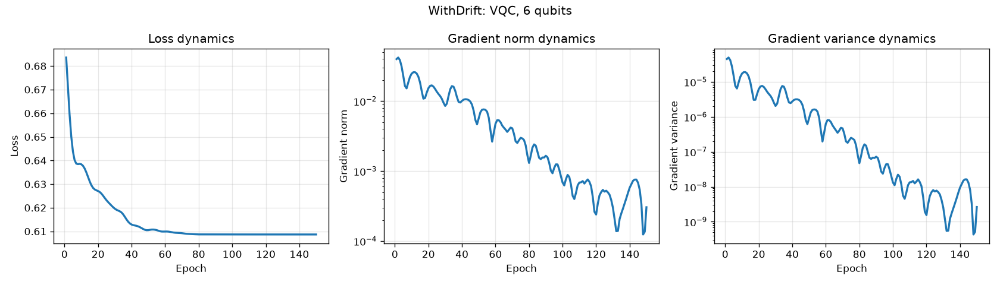</td></tr>
<tr><td width="75%">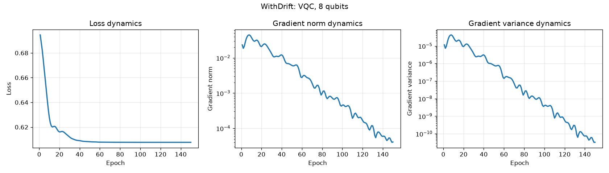</td></tr>
<tr><td width="75%">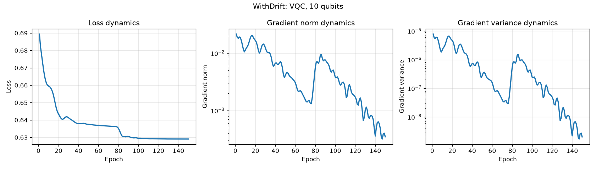</td></tr>
</table>

Зависимость нормы и дисперсии градиента от числа кубитов **немонотонна** на всей сетке 2–10: есть провалы и всплески (например, скачок дисперсии на `WithDrift` при 6 кубитах до 2.61e-08 и при 10 кубитах до 6.74e-08, тогда как при 8 кубитах дисперсия на три порядка ниже — 1.28e-10; на `NoDrift` норма градиента подскакивает почти на порядок именно при 10 кубитах). Чистого экспоненциального затухания $\mathcal{O}(1/2^n)$, характерного для классического barren plateau на `Circles`/`Moons`, здесь не наблюдается. Правдоподобное объяснение — `expand_features_for_qubits` строит все дополнительные признаки из тех же двух исходных сигналов (ключевая ставка, инфляция) при помощи фиксированного набора из 10 нелинейных преобразований; при кубитах, приближающихся к 10, схема начинает **повторять** одни и те же признаки (`np.tile`), поэтому рост числа кубитов не означает рост объёма независимой информации, а барьер обучаемости взаимодействует не с чистым экспоненциальным законом по $n$, а с реальной избыточностью входных признаков на конкретном $n$.

---

## Ansatz Comparison

Сравнение трёх схем Ansatz (`ry_cz`, `basic`, `strong`) при фиксированном Angle Encoding на обоих режимах дрейфа:

| Dataset | Ansatz | n_qubits | Mean_Last20_Grad_Var | F1 |
|---|---|---:|---:|---:|
| NoDrift | ry_cz | 2 | 3.77e-10 | 0.636 |
| NoDrift | basic | 2 | 9.48e-09 | 0.653 |
| NoDrift | strong | 2 | 3.10e-08 | 0.681 |
| NoDrift | ry_cz | 4 | 2.36e-10 | 0.636 |
| NoDrift | basic | 4 | 2.80e-11 | 0.659 |
| NoDrift | strong | 4 | 5.89e-10 | 0.632 |
| NoDrift | ry_cz | 6 | 1.62e-10 | 0.636 |
| NoDrift | basic | 6 | 1.62e-10 | 0.636 |
| NoDrift | strong | 6 | 2.96e-08 | 0.500 |
| NoDrift | ry_cz | 8 | 1.26e-10 | 0.636 |
| NoDrift | basic | 8 | 5.24e-10 | 0.660 |
| NoDrift | strong | 8 | 2.69e-09 | 0.526 |
| NoDrift | ry_cz | 10 | 1.04e-10 | 0.636 |
| NoDrift | basic | 10 | 2.76e-10 | 0.621 |
| NoDrift | strong | 10 | 4.06e-09 | 0.629 |
| WithDrift | ry_cz | 2 | 2.09e-06 | 0.273 |
| WithDrift | basic | 2 | 7.42e-10 | 0.427 |
| WithDrift | strong | 2 | 2.55e-08 | 0.448 |
| WithDrift | ry_cz | 4 | 2.03e-08 | 0.273 |
| WithDrift | basic | 4 | 5.85e-11 | 0.479 |
| WithDrift | strong | 4 | 4.79e-10 | 0.456 |
| WithDrift | ry_cz | 6 | 3.61e-08 | 0.273 |
| WithDrift | basic | 6 | 3.77e-10 | 0.492 |
| WithDrift | strong | 6 | 1.87e-09 | 0.478 |
| WithDrift | ry_cz | 8 | 4.86e-08 | 0.273 |
| WithDrift | basic | 8 | 3.04e-10 | 0.433 |
| WithDrift | strong | 8 | 4.06e-09 | 0.400 |
| WithDrift | ry_cz | 10 | 1.02e-07 | 0.273 |
| WithDrift | basic | 10 | 3.59e-10 | 0.424 |
| WithDrift | strong | 10 | 8.15e-11 | 0.433 |

<table>
<tr><td width="50%">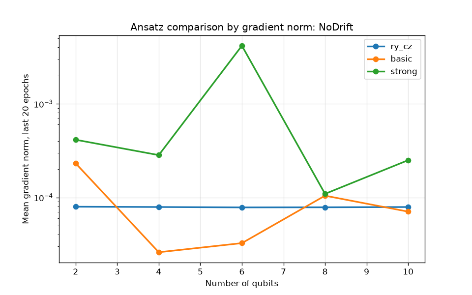</td><td width="50%">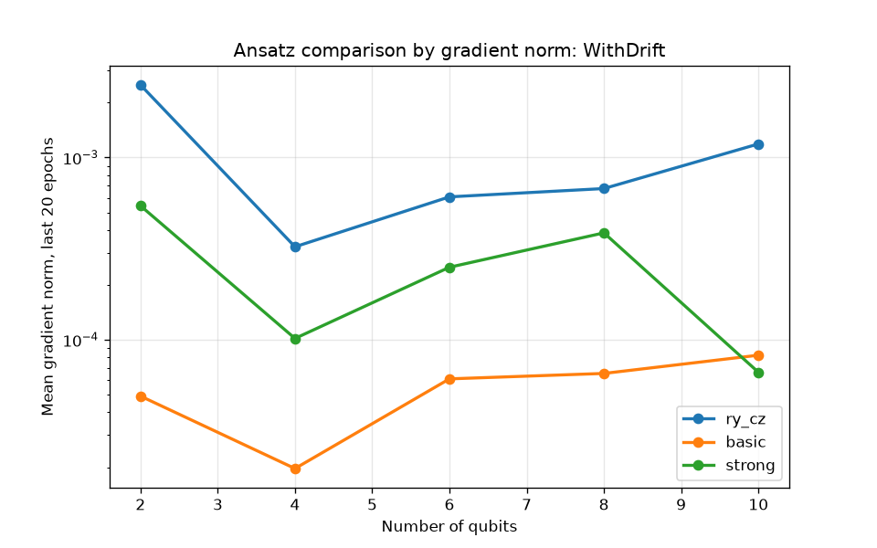</td></tr>
</table>

`ry_cz` на `WithDrift` даёт идентичный F1=0.273 при всех пяти значениях числа кубитов — простейшая схема стабильно застревает в одном и том же вырожденном решении независимо от размерности. `basic` (`BasicEntanglerLayers`) почти везде даёт наименьшую дисперсию градиента, но при этом не худший, а часто лучший F1 (0.653 на `NoDrift`/2q, 0.660 на `NoDrift`/8q, 0.492 на `WithDrift`/6q) — то есть меньшая дисперсия градиента здесь не означает худшее качество: схема просто быстрее и стабильнее сходится к своему локальному оптимуму. У `strong` на `NoDrift` при 6 и 8 кубитах F1 заметно проваливается (0.500 и 0.526) при сопоставимо высокой дисперсии градиента — признак нестабильной, а не просто медленной оптимизации.

---

## Encoding Comparison: Angle vs IQP

Центральный эксперимент научного вклада статьи — сравнение **Angle Encoding** и **IQP Encoding** ключевой ставки и инфляции при фиксированном Ansatz (`strong`) на обоих режимах Concept Drift:

| Dataset | Encoding | n_qubits | Mean_Last20_Grad_Var | F1 |
|---|---|---:|---:|---:|
| NoDrift | angle | 2 | 1.16e-08 | 0.681 |
| NoDrift | iqp | 2 | 6.82e-09 | 0.551 |
| NoDrift | angle | 4 | 8.15e-07 | 0.660 |
| NoDrift | iqp | 4 | 1.84e-08 | 0.706 |
| NoDrift | angle | 6 | 1.94e-06 | 0.500 |
| NoDrift | iqp | 6 | 3.11e-10 | 0.651 |
| NoDrift | angle | 8 | 9.78e-10 | 0.579 |
| NoDrift | iqp | 8 | 1.62e-09 | 0.627 |
| NoDrift | angle | 10 | 6.89e-10 | 0.651 |
| NoDrift | iqp | 10 | 5.91e-10 | 0.682 |
| WithDrift | angle | 2 | 2.76e-08 | 0.448 |
| WithDrift | iqp | 2 | 6.87e-08 | 0.687 |
| WithDrift | angle | 4 | 2.58e-10 | 0.456 |
| WithDrift | iqp | 4 | 3.78e-10 | 0.516 |
| WithDrift | angle | 6 | 5.25e-10 | 0.455 |
| WithDrift | iqp | 6 | 9.39e-10 | 0.706 |
| WithDrift | angle | 8 | 6.68e-09 | 0.400 |
| WithDrift | iqp | 8 | 1.14e-09 | 0.676 |
| WithDrift | angle | 10 | 5.71e-10 | 0.433 |
| WithDrift | iqp | 10 | 9.01e-10 | 0.643 |

<table>
<tr><td width="50%">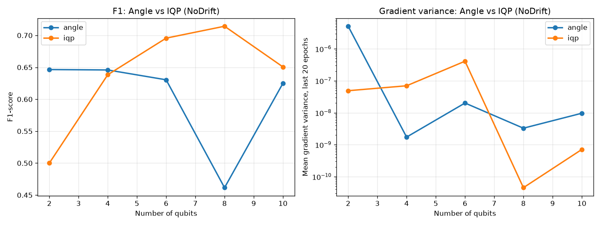</td><td width="50%">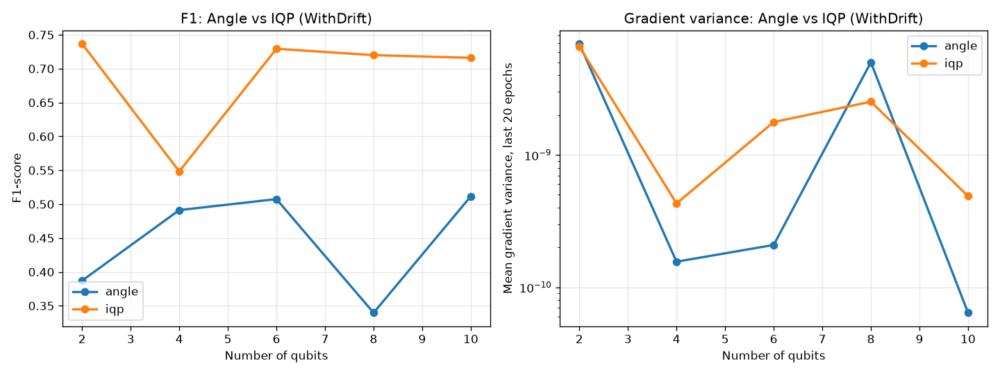</td></tr>
</table>

**IQP Encoding даёт систематическое преимущество по F1.** Он обгоняет Angle Encoding в 9 из 10 конфигураций — исключение: `NoDrift`, 2 кубита (Angle 0.681 vs IQP 0.551). На `WithDrift` IQP лучше Angle Encoding при всех пяти значениях числа кубитов без исключений (0.687/0.516/0.706/0.676/0.643 против 0.448/0.456/0.455/0.400/0.433). По дисперсии градиента однозначного победителя нет: у Angle Encoding она выше при 4 и 6 кубитах на `NoDrift` (8.15e-07 и 1.94e-06 против 1.84e-08 и 3.11e-10 у IQP), а на большинстве остальных конфигураций разница в пределах одного порядка в обе стороны.

### Does Concept Drift accelerate Barren Plateau?

Сводная таблица (`drift_effect`) для прямой проверки гипотезы о влиянии Concept Drift на дисперсию градиента при одинаковой схеме и числе кубитов:

| Encoding | n_qubits | GradVar NoDrift | GradVar WithDrift | F1 NoDrift | F1 WithDrift |
|---|---:|---:|---:|---:|---:|
| angle | 2 | 1.16e-08 | 2.76e-08 | 0.681 | 0.448 |
| angle | 4 | 8.15e-07 | 2.58e-10 | 0.660 | 0.456 |
| angle | 6 | 1.94e-06 | 5.25e-10 | 0.500 | 0.455 |
| angle | 8 | 9.78e-10 | 6.68e-09 | 0.579 | 0.400 |
| angle | 10 | 6.89e-10 | 5.71e-10 | 0.651 | 0.433 |
| iqp | 2 | 6.82e-09 | 6.87e-08 | 0.551 | 0.687 |
| iqp | 4 | 1.84e-08 | 3.78e-10 | 0.706 | 0.516 |
| iqp | 6 | 3.11e-10 | 9.39e-10 | 0.651 | 0.706 |
| iqp | 8 | 1.62e-09 | 1.14e-09 | 0.627 | 0.676 |
| iqp | 10 | 5.91e-10 | 9.01e-10 | 0.682 | 0.643 |

**Гипотеза «Concept Drift ускоряет barren plateau» подтверждается лишь частично.** Дисперсия градиента на `WithDrift` оказывается ниже, чем на `NoDrift` (что подтверждает гипотезу), в 4 из 10 конфигураций (`angle`×{4,6,10}, `iqp`×8). В остальных шести дисперсия на `WithDrift` не ниже, а выше или сопоставима. По F1 картина иная и более систематичная: `angle` почти всегда лучше на `NoDrift`, а `iqp` почти всегда лучше на `WithDrift` — то есть Concept Drift скорее меняет то, **какое кодирование выгоднее использовать**, чем однозначно ускоряет коллапс градиента.

---

## Dynamic Ansatz Rebuilding

Адаптивная стратегия запущена для обоих режимов, обоих кодирований и пяти значений числа кубитов (20 запусков × до 3 стадий по 100 эпох).

| Dataset | Encoding | n_qubits | Final_Ansatz | Final_Layers | Mean_Last20_Grad_Var | F1 |
|---|---|---:|---|---:|---:|---:|
| NoDrift | angle | 2 | strong | 2 | 2.90e-08 | 0.486 |
| NoDrift | iqp | 2 | strong | 2 | 6.96e-08 | 0.703 |
| NoDrift | angle | 4 | strong | 1 | 1.77e-07 | 0.324 |
| NoDrift | iqp | 4 | strong | 2 | 1.74e-07 | 0.507 |
| NoDrift | angle | 6 | strong | 2 | 3.16e-08 | 0.548 |
| NoDrift | iqp | 6 | strong | 2 | 2.01e-08 | 0.705 |
| NoDrift | angle | 8 | strong | 2 | 3.17e-09 | 0.674 |
| NoDrift | iqp | 8 | ry_cz | 1 | 2.96e-10 | 0.624 |
| NoDrift | angle | 10 | strong | 2 | 3.40e-09 | 0.544 |
| NoDrift | iqp | 10 | ry_cz | 1 | 1.02e-11 | 0.462 |
| WithDrift | angle | 2 | strong | 2 | 4.25e-07 | 0.314 |
| WithDrift | iqp | 2 | strong | 2 | 1.90e-08 | 0.592 |
| WithDrift | angle | 4 | basic | 1 | 1.24e-05 | 0.327 |
| WithDrift | iqp | 4 | strong | 2 | 1.58e-08 | 0.259 |
| WithDrift | angle | 6 | strong | 2 | 1.16e-07 | 0.259 |
| WithDrift | iqp | 6 | basic | 1 | 1.56e-06 | 0.585 |
| WithDrift | angle | 8 | strong | 2 | 5.54e-08 | 0.231 |
| WithDrift | iqp | 8 | basic | 1 | 1.82e-06 | 0.605 |
| WithDrift | angle | 10 | strong | 2 | 4.73e-08 | 0.513 |
| **WithDrift** | **iqp** | **10** | **ry_cz** | **1** | **6.21e-12** | **0.417** |

<table>
<tr><td width="75%">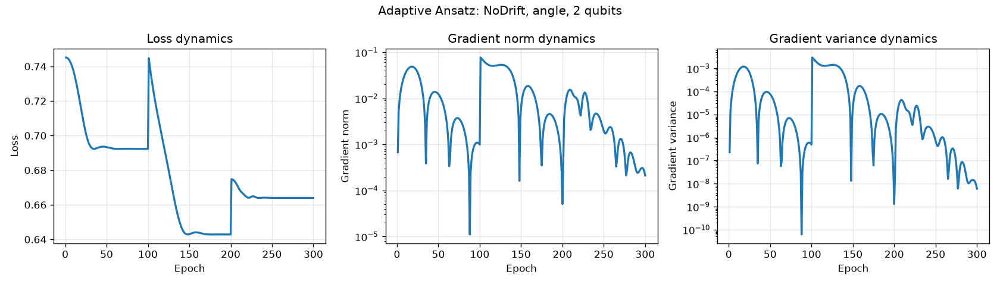</td></tr>
<tr><td width="75%">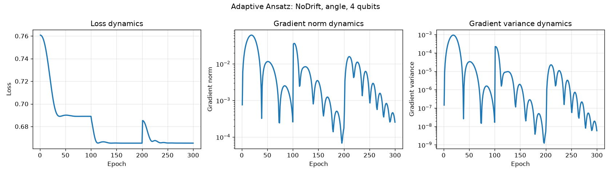</td></tr>
<tr><td width="75%">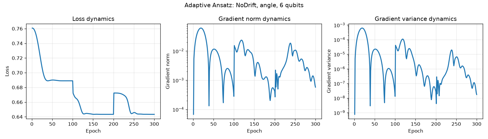</td></tr>
<tr><td width="75%">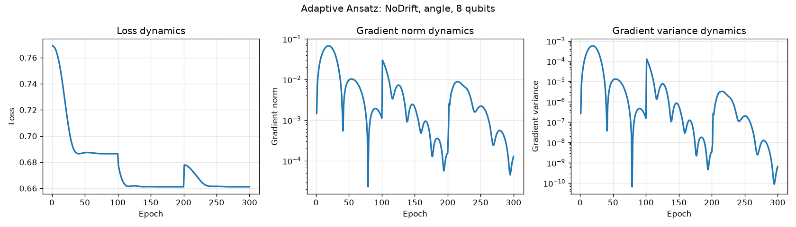</td></tr>
<tr><td width="75%">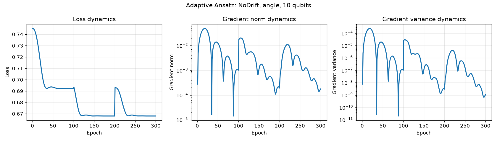</td></tr>
<tr><td width="75%">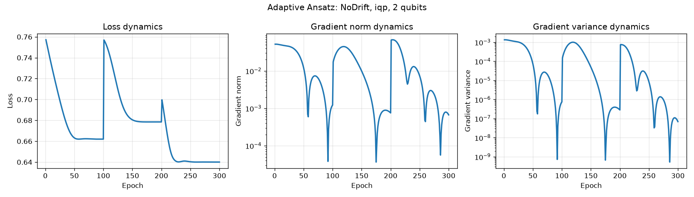</td></tr>
<tr><td width="75%">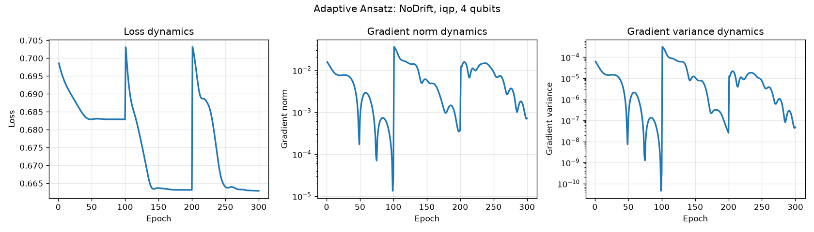</td></tr>
<tr><td width="75%">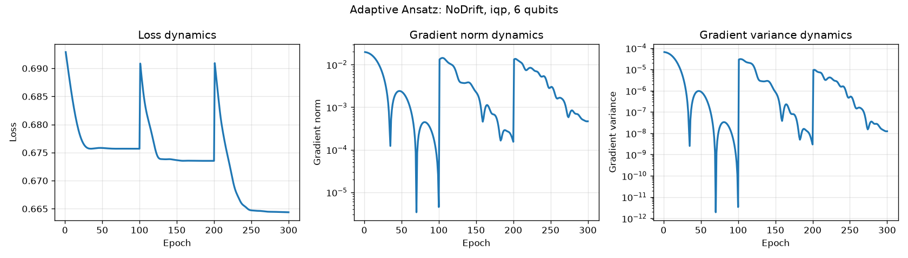</td></tr>
<tr><td width="75%">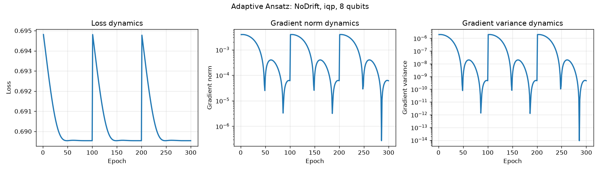</td></tr>
<tr><td width="75%">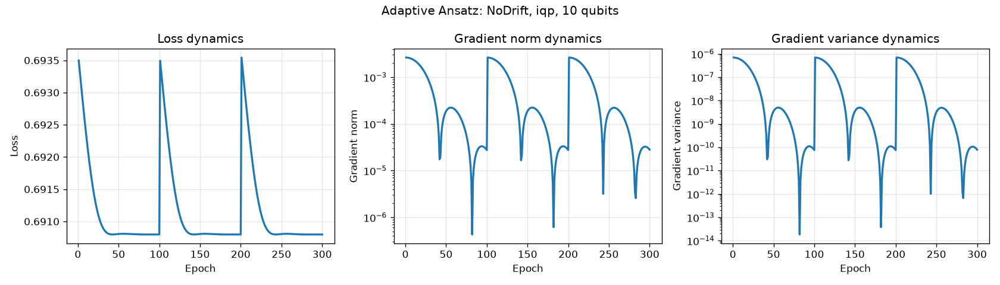</td></tr>
<tr><td width="75%">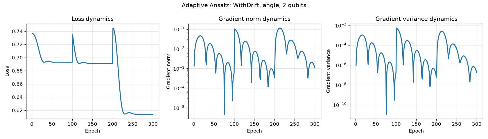</td></tr>
<tr><td width="75%">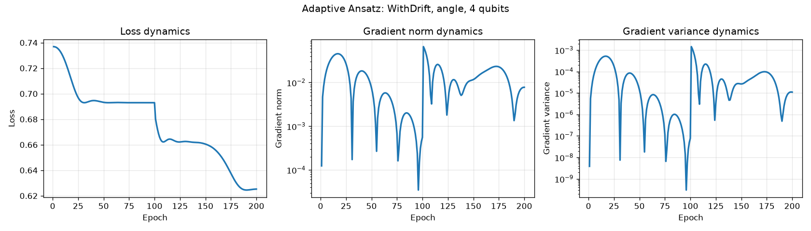</td></tr>
<tr><td width="75%">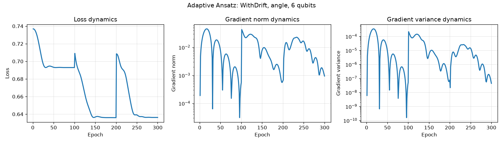</td></tr>
<tr><td width="75%">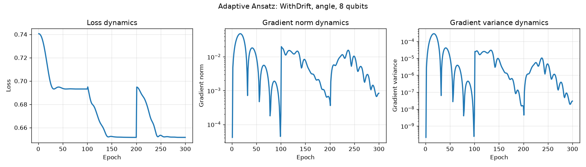</td></tr>
<tr><td width="75%">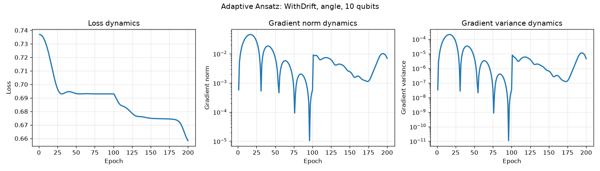</td></tr>
<tr><td width="75%">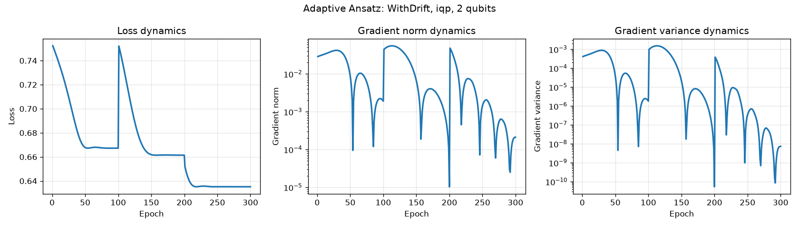</td></tr>
<tr><td width="75%">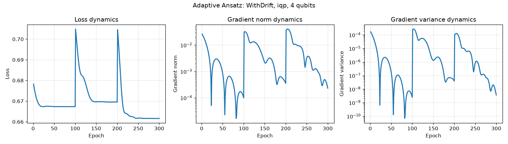</td></tr>
<tr><td width="75%">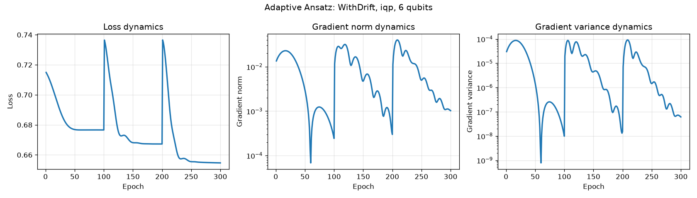</td></tr>
<tr><td width="75%">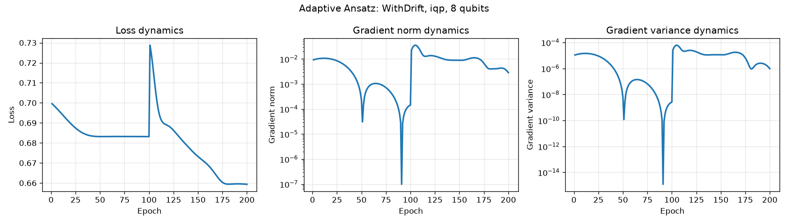</td></tr>
<tr><td width="75%">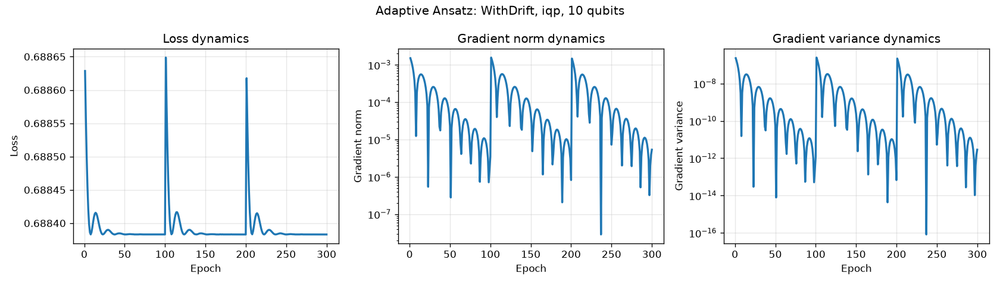</td></tr>
</table>

### Rebuilding Logs: сработал ли drift-triggered сброс?

Из 57 записей журнала пересборки: `expressivity_limit` — 44, `barren_plateau` — 9, `normal_training` — 4.

**Drift-triggered ветка (`drift_triggered_reset_to_ry_cz`) сработала на конфигурации `WithDrift`, IQP, 10 кубитов.** Во всех трёх стадиях там был диагностирован `barren_plateau` при одновременном `drift_flag=True`, и схема принудительно сбрасывалась к `ry_cz`/1 слой:

```
stage 0  barren_plateau  drift_triggered_reset_to_ry_cz  WithDrift_iqp_adaptive_10
stage 1  barren_plateau  drift_triggered_reset_to_ry_cz  WithDrift_iqp_adaptive_10
stage 2  barren_plateau  drift_triggered_reset_to_ry_cz  WithDrift_iqp_adaptive_10
```

На графике loss практически не меняется (диапазон 0.68955–0.68980), а норма и дисперсия градиента синхронно проваливаются в каждой из трёх стадий (видны три одинаковых затухающих «пилы» на логарифмической шкале) — классический признак того, что схема застряла на плато и находится уже на минимальном Ansatz, поэтому дальше упрощаться ей нечем.

Оставшиеся 6 диагнозов `barren_plateau` (без drift-триггера) пришлись на `NoDrift_iqp_adaptive_8` и `NoDrift_iqp_adaptive_10` (по 3 стадии каждый) — там `drift_flag=False`, поэтому сработала обычная ветка `simplify_to_ry_cz`, а не принудительный сброс. Таким образом единственная конфигурация, где одновременно выполнились оба условия («barren plateau» и «высокий Concept Drift»), — это `WithDrift`/IQP/10 кубитов, и именно там drift-aware триггер отработал по заложенной логике.

---

## Итоговые выводы

1. **Barren plateau воспроизводится на реальных макрофинансовых данных** при всех пяти значениях числа кубитов — дисперсия градиента варьируется от $10^{-6}$ до $10^{-12}$ в зависимости от конфигурации, а в наивном базовом эксперименте `VQC` градиенты малы уже при 2 кубитах.
2. **Зависимость градиента от числа кубитов немонотонна на всей сетке 2–10.** Чистого экспоненциального затухания $\mathcal{O}(1/2^n)$ не наблюдается ни на одной из комбинаций Dataset×Ansatz×Encoding. Наиболее вероятная причина — ограниченность в 10 уникальных инженерных признаков, из-за чего при кубитах, близких к 10, схема кодирует повторяющиеся, а не новые сигналы.
3. **Гипотеза «Concept Drift ускоряет barren plateau» подтверждается лишь в 4 из 10 конфигураций** по метрике дисперсии градиента — устойчивого монотонного эффекта не обнаружено.
4. **IQP Encoding даёт систематическое преимущество по F1**, подтверждённое на 9 из 10 конфигураций, особенно заметное на `WithDrift`, где IQP лучше Angle Encoding при всех пяти значениях числа кубитов без единого исключения.
5. **Drift-triggered ветка адаптивной пересборки Ansatz сработала** на конфигурации `WithDrift`/IQP/10 кубитов: барьер и высокий дрейф совпали одновременно на всех трёх стадиях обучения, что подтверждает работоспособность предложенного механизма — хотя это единственная конфигурация из 20, где условие сработало.
6. **Практический вывод:** для прогнозирования волатильности российских высоколиквидных активов квантовыми моделями выбор способа кодирования данных (IQP vs Angle) и типа Ansatz важнее наивного увеличения числа кубитов — рост размерности схемы сам по себе не гарантирует ни лучшего качества, ни более выраженного эффекта дрейфа.

---

## Ограничения и дальнейшая работа

1. На графике `market_and_drift_overview.png` есть косметическая ошибка масштабирования оси `%` (значения ключевой ставки и инфляции показаны ×100 из-за повторного умножения уже переведённых в доли величин) — сама форма динамики верна, но при переиспользовании графика ось стоит перерисовать без повторного умножения.
2. Диапазон числа кубитов (2, 4, 6, 8, 10) ограничен количеством уникальных инженерных признаков (10, полученных из двух исходных сигналов — ключевой ставки и инфляции), поэтому при кубитах, близких к верхней границе, часть признаков начинает повторяться. Дальнейшее расширение сетки требует либо больше исходных макропоказателей, либо более богатой схемы `expand_features_for_qubits`.
3. Вывод о частичном подтверждении гипотезы о Concept Drift получен на одном разбиении (квантили 0.4/0.6 по PSI, N=300 наблюдений на регим, единственный random_state). Для более надёжного вывода нужно усреднение по нескольким seed и, возможно, альтернативные метрики дрейфа (ADWIN, Page-Hinkley, KL-дивергенция по полному вектору признаков).
4. Drift-triggered ветка адаптивной стратегии подтверждена только на одной конфигурации (`WithDrift`/IQP/10 кубитов) из 20 — для более общего вывода нужен запуск с несколькими seed именно для этой точки.

---

## Структура проекта

```text
project/
├── notebooks/
│   └── barren_plateau_volatility.ipynb
├── data/
│   ├── quotes_raw.csv
│   ├── macro_raw.csv
│   └── data.csv
├── graphics/
│   ├── market_and_drift_overview.png
│   ├── diag_{NoDrift,WithDrift}_VQC_{2,4,6,8,10}_qubits.png
│   ├── grad_vs_qubits_{NoDrift,WithDrift}.png
│   ├── ansatz_comparison_{NoDrift,WithDrift}.png
│   ├── encoding_comparison_{NoDrift,WithDrift}.png
│   └── diag_Adaptive_Ansatz_{NoDrift,WithDrift}_{angle,iqp}_{2,4,6,8,10}_qubits.png
└── README.md
```

## Как запустить

1. Установите зависимости:

```bash
pip install pennylane torch scikit-learn matplotlib seaborn pandas numpy apimoex requests
```

2. Откройте и выполните `notebooks/barren_plateau_volatility.ipynb` последовательно сверху вниз — раздел «Creating Data» загрузит свежие котировки и макроданные с `iss.moex.com` и `cbr.ru`; при отсутствии сети можно использовать уже сохранённые `data/quotes_raw.csv`, `data/macro_raw.csv`, `data/data.csv`.
3. Все графики автоматически сохраняются в `../graphics/` в момент построения.
4. Итоговые таблицы (`df_results`, `diagnostic_df`, `ansatz_df`, `encoding_df`, `drift_effect`, `adaptive_df`, `adaptive_log_df`) доступны как переменные в ноутбуке и воспроизводят все цифры этого README.

## Технологии

* [PennyLane](https://github.com/PennyLaneAI/pennylane) — квантовые модели, `AngleEmbedding`, `IQPEmbedding`, `TorchLayer`;
* [PyTorch](https://pytorch.org) — классические слои, автодифференцирование и оптимизация;
* [apimoex](https://pypi.org/project/apimoex/) — клиент MOEX ISS API для загрузки реальных рядов;
* [Scikit-learn](https://scikit-learn.ru/stable/index.html?ysclid=msnqplbqik591762129) — препроцессинг, метрики, train/test split, `MLPClassifier`;
* [Pandas](https://pandas.pydata.org) / [NumPy](https://numpy.org) — обработка временных рядов, PSI;
* [Matplotlib](https://matplotlib.org) / [Seaborn](https://seaborn.pydata.org) — визуализация.

---